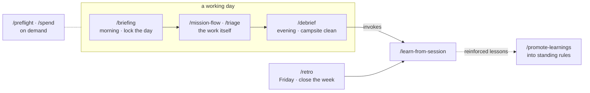

# The Skills - Mission Control's rituals, installable

Eighteen skills, five groups - each maps to a ritual a real engineering
lead already runs. None overlaps another's job. The portfolio-wide ones
take `--front <name>` / `--project <name>` scope flags: unscoped keeps
the whole-portfolio default; scoped invocations read and write only that
slice (which is also how parallel per-front sessions coexist - see the
concurrency convention in `framework/continuity-stack.md`).

| Group | Skill | One line | When |
|---|---|---|---|
| **Cadence** | `briefing` | Read the board, report state per front, lock today's ONE objective | every morning |
| | `debrief` | Roll up progress, rewrite the pointer, surface founder-gated items, capture lessons | every evening |
| | `retro` | Shipped / live / stuck per front, scoreboard, week-scale lessons, next week locked | Fridays |
| **Delivery** | `mission-flow` | Bug/task to merged-ready PR: the fixed 8-phase playbook (Jira, GitHub Issues, or the native task board) | per work item |
| | `triage` | Messy inbox to per-project task boards, one table, STOP-gated | when items pile up |
| | `log-deviation` | Canonical register row + body, logged BEFORE the fix | on any drift from plan |
| | `today-progress-summary` | Paste-ready standup for Slack / Jira / WhatsApp | end of day |
| **Learning** | `learn-from-session` | Session lessons through an 8-rule critique gate into the right store | at debrief, or anytime |
| | `promote-learnings` | Reinforced lessons drafted into standing rules, founder-gated | periodically |
| **Portfolio** | `new-front` | Detect-first onboarding of a new project: hub, spokes, board row | new project |
| | `retire-front` | Founder-gated archive of a finished front: history intact, rotation cleared | engagement ends |
| | `map-front` | Dependency graph per front at chosen depth (`--depth 1|2|3`); feeds mission-flow's blast radius | intersecting projects |
| | `preflight` | Instance health check + cold-read proof + size-cap enforcement | after pulls / changes |
| | `spend` | The token-economy meter: model x effort tally, doctrine violations, one adjustment | heavy days |
| **Docs** | `as-built` | Promote a done+verified plan into a living doc; retire the plan | feature ships |
| | `doc-voice` | Neutral professional register pass; removes AI tells and process leakage | before a doc ships |
| | `adr` | Decision record: context, decision, alternatives rejected, consequences | decisions |
| | `docs-viewer` | Live local docs browser with Mermaid rendered as diagrams | anytime (needs Node) |

## Install

Nothing to install: these skills live at `.claude/skills/` inside the
repo, so the harness discovers them the moment you clone, and
`git pull upstream main` updates them in place - no stale copies.

Want them in ALL your projects, not just this portfolio? Copy the
folders to `~/.claude/skills/` (and re-copy after doctrine pulls, since
global copies do not auto-update).

Invoke as `/<name>` (e.g. `/briefing`). Skills are plain markdown - read
any `SKILL.md` to see exactly what it will do before you run it. Name
collision with your global `~/.claude/skills`? Inside this portfolio the
project-scoped copies win (most specific wins).

## The authority note

`mission-flow` carries a scoped git grant: one invocation authorizes
commit + push + PR creation for that one ticket, expiring when the PR
opens. Every other skill observes the standing default: no git writes
unless the founder asks in the moment. Skills that write files
(`triage`, `as-built`, `promote-learnings`, `retire-front`) carry their
own STOP gates.
