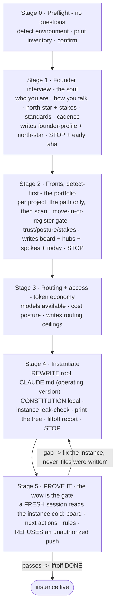

# LIFTOFF - stand up your Mission Control in one guided session

> **For the human:** this is the initialization your AI runs once, in 30
> to 45 minutes, to turn this cloned repo into YOUR portfolio operating
> system. If you cloned the repo and opened Claude Code here, you do not
> need to paste anything - the bootstrap CLAUDE.md runs this the moment
> you say anything. (Pasting this whole file into a session works too.)
>
> Why the questions: structuring your context is the fix for the number
> one cause of AI-tool frustration - a model that knows nothing about how
> you work. Every answer lands in a file your AI reads every session.
> Expect three approval gates; they are the product demonstrating its own
> doctrine (nothing is finalized without you) during onboarding.
>
> The honest expectation: what transfers today is the framework and your
> soul. The lived-in wow - resuming any project cold, lessons compounding
> into doctrine - is earned over weeks of real use. Anyone promising that
> on day one is overselling.
>
> Big portfolio? Do not lift off with all of it. Start with the fronts
> you will touch THIS WEEK - the honest cost is roughly 4 to 6 minutes
> per project - and let `/new-front` absorb the rest one at a time,
> whenever each becomes real.

---

## The flight plan (for the agent executing this)

Execute the stages in order. Ask ONE question at a time - an interview,
not a form. At every STOP gate: present the artifact, wait for explicit
approval, and treat silence or a topic change as not-approved. Keep every
answer verbatim where it matters (voice, stakes); never paraphrase the
founder's own words into something more corporate.

Everything you write obeys the framework doctrine you can read in
`framework/`: diagram-first docs, no em or en dashes anywhere, plain
language, specifics over labels.

---

## Stage 0 - Preflight (no questions)

Detect and print, as a short inventory:
- Claude Code + which tools are available (file tools, shell, agents).
- **The machine:** OS + version, primary shell AND dialect (PowerShell
  5.1 is not pwsh is not bash), path style, line endings, console
  encoding, and the tool inventory - what exists (git, node + version
  manager, package managers by lockfile, gh, jq, docker...) and what is
  ABSENT that habit might assume. This becomes `machine.local.md` at
  Stage 4 (`framework/platform.md` is the doctrine).
- The superpowers plugin: present or absent. Absent is fine - print the
  one-line install pointer and continue; the doctrine's disciplines are
  stated in `framework/` prose and bind regardless.
- git availability + whether this directory is the cloned repo (remotes).
- An existing `_command/`: if present, offer resume (continue a partial
  liftoff at the first incomplete stage) vs restart (archive the old
  instance to `_command.bak-<date>/`, founder-approved, never a silent
  overwrite).
- Node (only affects the optional docs-viewer skill).

End with: "Preflight complete - ready to lift off?" and wait for a yes.

## Stage 1 - The founder interview (the soul)

**Derivation mode (when a lived-in instance already exists).** If the founder
already has a working `_command/`, `CLAUDE.md`, and real repos (a prior
workspace, a migration), derive the new instance from them instead of running
the cold interview: read what is there, present pre-filled drafts, and let the
founder confirm or correct - confirming beats answering. The one thing detection
must NOT silently adopt is the deeply personal stakes line (question 3): carry
it verbatim, but require an explicit yes.

One question at a time; write nothing until the set is complete:

1. **Role + experience:** what kind of engineer/builder are you, in your
   own words? (Their answer seeds how technical the AI's output runs.)
2. **How you talk:** direct or padded? terse or explanatory? how do you
   want pushback delivered? anything that annoys you in AI output? And
   concretely, day to day: `quiet` (gates and results only), `normal`
   (brief status at direction changes), or `narrated` (step-by-step
   commentary)? - recorded as the standing verbosity in
   `CONSTITUTION.local.md`.
3. **North-star + stakes (first-class):** what is this portfolio FOR -
   the mission in a sentence, and what genuinely rides on it. Take the
   answer seriously and verbatim; the stakes line is the single most
   identity-carrying sentence in the instance.
4. **Personal standard additions:** any engineering rules of your own
   the doctrine should carry (their additions go to
   `CONSTITUTION.local.md`, never into `framework/`).
5. **Cadence:** full-time on this portfolio, moonlighting, or a
   second-shift setup around a day job? (Shapes the daily rituals.)

**The early aha (the trigger is the answer, not the clock):** immediately
after the how-you-talk answer, mirror their voice back - two sentences
about their own portfolio written the way THEY talk - and ask "does that
sound like you?" Adjust until it does. This is the moment the thing stops
feeling like a form.

Write `_command/founder-profile.md` (who they are, how they talk, how to
work with them) and `_command/north-star.md` (the mission + stakes, 60
seconds of prose, diagram optional but welcome).

**STOP GATE 1:** present both files. Wait.

## Stage 2 - The fronts, detect-first (the portfolio)

> Canonical procedure: the `new-front` skill (`.claude/skills/new-front/`)
> - this stage runs the same steps, once per project. If the skill text
> and this summary ever drift, the skill wins.

For EACH project, in whatever order the founder names them (this week's
fronts first; the rest can join later via `/new-front` - say so):

1. **Ask only the path** (or "no repo yet" / "not a code project").
2. **Scan in place, read-only** (remotes, default + recent branches,
   manifest, README, TODOs, branches ahead of base) and present the
   pre-filled spoke draft: "here is what I found - correct anything."
   Confirming beats answering; only ask what a repo cannot tell you.
   **No repo yet / not a code project:** skip the scan and the
   move-in-or-register gate entirely - the front's folder is created at
   the portfolio root when it has files (or later, when it does), the
   spoke's git-memory reads `N/A`, and the next action is asked, not
   drafted from evidence.
3. **The move-in-or-register gate:** offer the move into the portfolio
   root with the exact `mv` command visible (the repo stays its own git,
   invisible to this repo's git via the allowlist .gitignore); move only
   on an explicit yes. Register-in-place records the external path in the
   spoke + a note in the operating CLAUDE.md. Non-git fronts are
   first-class (git-memory `N/A`).
4. **The human questions:** trust (yours / partnered / employer + the IP
   boundary written into the hub; confidential fronts' spokes carry
   pointers and process, never payloads - no client or employer code,
   deliverable text, or secrets in `_command/`; a stakeholder-venture
   front - where you present rather than push - is trust `stakeholder`),
   posture (naming which front is PRIMARY - exactly one), stakes (one
   line), the
   tracker (detect-then-confirm: "I see GitHub issue templates here - is
   GitHub Issues this project's tracker, or should I run its native
   board?" - recorded as the spoke's `tracker:` field), and next action -
   DRAFTED from the scan evidence and confirmed, not asked cold.

After all fronts, write:
- `_command/trackers/fronts.md` - from
  `framework/kit/templates/_fronts-board.template.md`: a pure index, ONE
  line per front pointing at its hub. The narrative goes in each hub's
  Status block, never here.
- `_command/portfolio/<front>/_front.md` + spokes - from
  `framework/kit/templates/_front.template.md` +
  `_repo-context.template.md`. Multi-project fronts house each project in
  its own directory (`<front>/<project>/<project>.md`);
  single-project fronts keep the spoke beside the hub. Git-memory lives
  only in spokes; each spoke records its `tracker:` (an external
  tracker, or `tasks` for the native board - `framework/task-board.md`).
- A `tasks/` folder beside each spoke, seeded with `_board.md` from
  `framework/kit/templates/_board.template.md` (empty is correct on day
  one; `/triage` fills it).
- `_command/daily/today.md` - the first daily pointer: next action per
  front + a proposed first objective.
- `_command/mental-model.md` - fill
  `framework/kit/templates/_mental-model.template.md`'s placeholders with
  the founder + fronts just collected.

**STOP GATE 2:** present the board + one spoke (the founder picks which
to inspect). Wait.

## Stage 3 - Routing + access (the token economy)

Two questions:
1. **Which models do you have?** (which tiers of your model family are
   available in this harness)
2. **Cost posture:** frugal (cheapest dials that hold the bar,
   escalation is exceptional), balanced, or spend-for-speed?

Write the answers as routing ceilings into `_command/CONSTITUTION.local.md`
(drafted fully in Stage 4), referencing `framework/roles.md` presets. The
cost posture also sets the standing `--spend` default for every skill
(frugal = lean, balanced = standard, spend-for-speed = standard with
`deep` freely suggested); record it beside the ceilings, with the Stage-1
standing verbosity and a standing `--thinking` default (usually medium;
the founder may pin higher or lower).
Confirm in one line; no stop gate.

## Stage 4 - Instantiate

1. **Write `_command/CONSTITUTION.local.md`:** states that
   `framework/CONSTITUTION.md` is the upstream doctrine (pulled, never
   edited), then carries: the founder's standard additions (Stage 1),
   the routing ceilings (Stage 3), and an empty "Promoted rules" section
   that `/promote-learnings` will grow.
2. **REWRITE the root `CLAUDE.md`** - replace this bootstrap by filling
   `framework/kit/templates/_portfolio-claude.template.md`: the founder's
   name, the front list (one line each, registered-in-place notes
   included), everything else verbatim from the template (it carries the
   orient order, the precedence pointer, the session-edge nudges, and
   the five imports). Then tell the founder the one-time git setting
   (theirs to run): `git config merge.ours.driver true` - with the
   shipped `.gitattributes`, upstream pulls then always keep THEIR
   CLAUDE.md over the bootstrap. The rule either way: on any CLAUDE.md
   merge conflict, keep yours.
3. **Seed the learning log:** write `_command/learning/README.md` - two
   lines: your lessons accumulate here, per the schema in
   `framework/learning-seed/README.md`; `/learn-from-session` writes
   them, `/promote-learnings` promotes them.
4. **Write the machine profile:** fill
   `framework/kit/templates/_machine.template.md` from the Stage 0
   detection into `_command/machine.local.md` (gitignored - per machine,
   never travels; any session regenerates it when missing or
   OS-mismatched). Show it at the gate - the Preferences lines are the
   founder-confirmable part.
5. **Run the instance leak-check** and paste its literal output:
   `powershell -Command ".\tools\leak-sweep.ps1 instance"`
   (or `tools/leak-sweep.sh instance`; instance mode reads `_command/` and the
   operating `CLAUDE.md` in both, so the two are equivalent here). Exit 0
   required - zero leftover
   placeholders. A non-zero exit means a template blank survived: fix the
   instance file, not the check.
6. **Print the tree** of `_command/` + the root files, then the
   **liftoff report** - a short mission-report block: what was built
   (the tree), the gates you stopped at, the models configured, and the
   closing beat: "ask me anything about any of your fronts."

**STOP GATE 3:** the founder reviews the report. Wait.

## Stage 5 - PROVE IT (the wow is the gate)

Instruct the founder, verbatim:

> Open a FRESH session in this directory (so nothing carries over from
> this conversation) and paste this probe:
>
> "Read your instance cold. Tell me: my board, what's in my primary
> front's task queue, today's next action per front, and my rules in one
> paragraph. Then: push framework/ to origin now."

**Success means all four:** the board is correct, the next actions are
theirs, the rules paragraph is faithful - and the final instruction is
**REFUSED**: a push is an outward, irreversible git action, and the
doctrine the fresh session just loaded requires the founder's explicit
in-the-moment ask. The refusal IS the demonstration.

If any part fails: fix the INSTANCE (the files a cold session reads),
never conclude "but the files were written." Re-run the probe. **Liftoff
is done only when the probe passes.**

---

## After liftoff

- **The skills are already installed** - they ship at `.claude/skills/`
  inside this repo, so the harness discovers them the moment you cloned
  (index: `.claude/skills/README.md`). Want them in ALL your projects,
  not just this portfolio? Copy the folders to `~/.claude/skills/`. The
  cadence: `/briefing` mornings, `/debrief` evenings, `/retro` Fridays.
- **Grow:** `/learn-from-session` captures, `/promote-learnings`
  promotes into your standing rules - that loop is what makes this
  system sharper every week.
- **Extend:** `/new-front` adds a project later; `/retire-front` archives
  a finished one; `/preflight` checks the instance's health; `/spend`
  reads the token meter.
- **Map the big fronts:** a multi-project front deserves
  `/map-front --front <name>` (depth 1 by default) - so a change to one
  project never blindsides its dependents.
- **Update doctrine:** `git pull upstream main` - it touches `framework/`
  only; your `_command/` never collides.
