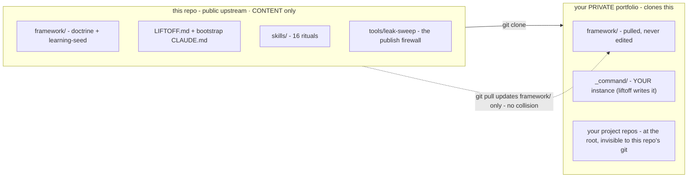

# mission-control

A CTO-grade operating system for your portfolio of projects, pre-loaded
with hard-won engineering doctrine: governance that will not wreck your
repo or your bill, continuity across every project, and a learning loop
that makes it sharper every week.



## The 60-second start

```bash
git clone https://github.com/<founder-account>/mission-control my-portfolio
cd my-portfolio && claude
> hi
```

That is the whole install. The bootstrap takes over from your first
message and runs LIFTOFF: a guided session (roughly 4 to 6 minutes per
project, three approval gates) that interviews you, scans your actual
repos rather than interrogating you about them, and stands up your
instance - ending with a proof: a fresh session reads your setup cold,
states your board and your rules, and **refuses an unauthorized push**.
The refusal is the product working. Big portfolio? Lift off with the
fronts you'll touch this week; `/new-front` absorbs the rest one at a
time.

## What you get

1. **Governance and cost-safety.** It never self-approves irreversible
   actions - commits, pushes, deploys, spends - and it right-sizes every
   sub-agent (model x effort, deliberately) with fan-outs sized and
   approved before they fire. Built against the documented failure modes
   of autonomous tooling: four-figure weekend bills, wiped repos, merged
   nothing.
2. **Portfolio continuity.** One root, many projects, each with a hub,
   per-repo spokes carrying git-memory, a single daily pointer, and
   per-project state - so you resume any front with zero re-briefing.
3. **It gets wiser.** Every session's lessons pass an 8-rule critique
   gate into a learning log; the repeatedly-reinforced ones get promoted
   (with your sign-off) into standing rules that load every session. The
   seed corpus ships with the repo: 24 lessons paid for on a real
   multi-front portfolio.
4. **Markdown plumbing.** Local, git-versioned, yours. Plain files you
   can read, edit, and take with you - no lock-in, no hosted anything.

## What this is NOT

Not an autonomous coder, and not instant magic. On day one you get the
framework and a faithful profile of how you work; the lived-in
impressiveness - cold-resuming a months-old project, doctrine grown from
your own lessons - is earned over weeks of real use. Tools that promise
that on day one are selling session-one speed that feels reckless by week
three. This system is deliberately the opposite design center:
disciplined, continuous, economical, self-improving.

## Your repos, one root

Your project repos live INSIDE the portfolio folder, next to `_command/`.
The allowlist `.gitignore` tracks only the operating system's own files,
so anything you drop at the root - entire repos included - is invisible
to this repo's git: no nesting weirdness, no accidental commits of your
codebase, and every session opens with the whole portfolio in view.
LIFTOFF offers the move per project (or registers a repo where it is, if
you prefer).

## What governs by default

No skill invoked = still governed: the always-loaded doctrine binds every
session (evidence before claims, no self-approval, nothing irreversible
without you). The skills are formalized escalations, not the only carrier
of discipline - the CONSTITUTION's "default session" section spells it out.

The enforcement model, plainly: doctrine loaded into every session's
context, your harness's permission gates on tool use, and your own review
gates. Prose does not sandbox a model - which is why liftoff ends by
demonstrating the discipline (the refusal), not just declaring it.

## The 18 skills

Pre-installed rituals: they ship at `.claude/skills/` inside the repo, so
cloning IS installing and pulling updates them. The portfolio-wide ones
take `--front` / `--project` scope flags, plus three universal dials -
`--spend` (cost), `--thinking` (reasoning depth), `--verbosity` (how much
it talks). The full table is in
[`.claude/skills/README.md`](.claude/skills/README.md):

- **Cadence:** `briefing` (morning) · `debrief` (evening) · `retro`
  (weekly)
- **Delivery:** `mission-flow` (bug/task to merged-ready PR, 8 phases) ·
  `triage` · `log-deviation` · `today-progress-summary`
- **Learning:** `learn-from-session` · `promote-learnings`
- **Portfolio:** `new-front` · `retire-front` · `map-front` · `preflight` · `spend`
- **Docs:** `as-built` · `doc-voice` · `adr` · `docs-viewer`

## Updating doctrine

Keep this repo as `upstream`; your portfolio lives on your own private
`origin`:

```bash
git remote rename origin upstream
git remote add origin <your-private-repo-url>
git pull upstream main    # updates framework/ + skills only; your _command/ never collides
```

After every pull, read the new entries in [CHANGELOG.md](CHANGELOG.md) -
doctrine changes never reach you silently.

Two notes on pulls: enable `git config merge.ours.driver true` once (the
shipped `.gitattributes` then keeps YOUR rewritten CLAUDE.md over the
bootstrap on every pull - and if a CLAUDE.md conflict ever appears
anyway, keep yours). And your portfolio travels whole: clone your private
origin on any machine and the OS, the skills, and your state all arrive -
`_command/`, `CLAUDE.md`, and `.claude/skills/` are all tracked. Each
machine keeps its own auto-detected platform profile
(`machine.local.md`, gitignored) - regenerated on the first session
there, so commands are always composed for the OS and shell actually
under them.

## Requirements

- **Claude Code** (required) - the harness this v1 is native to.
- **The superpowers plugin** (recommended) - the doctrine references its
  disciplines (brainstorming, test-driven development, systematic
  debugging); everything degrades gracefully to the prose versions in
  `framework/` without it.
- **Node** (optional) - only for the `docs-viewer` skill.
- **Windows or macOS/Linux** - both first-class; the sweep ships as
  PowerShell + bash twins.

## Provenance and license

mission-control consolidates two lineages battle-tested on a real
multi-front portfolio: a **governance kit** (gate-locked phases,
evidence-before-claims, deviations registers) and an **orchestration
method** (sub-agent routing, context isolation, the learning loop). The
`framework/learning-seed/` lessons are the real corpus, de-personalized.
The `tools/leak-sweep` firewall is what guarantees that de-personalization
stays true on every future publish.

**License: PolyForm Noncommercial 1.0.0** - see [LICENSE](LICENSE).
Free for personal and noncommercial use. Commercial use of the software
itself (reselling it, hosting it as a service, or building commercial
products on it) is not granted by this license - a commercial offering
built around mission-control is planned by the author. For commercial
licensing, open an issue on this repository.
