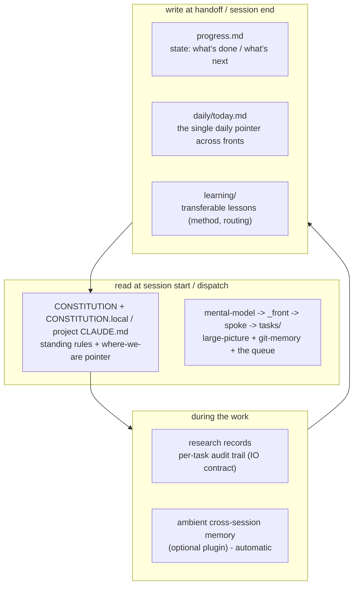

# Continuity Stack

> We have several memory systems. Without clear jobs they overlap and rot. **Each layer has exactly one job.** This doc is the dedup.

## Each layer, one job

| Layer | Single job | When written | When read |
|---|---|---|---|
| `framework/CONSTITUTION.md` + `_command/CONSTITUTION.local.md` / project `CLAUDE.md` | Standing rules + the "where we are" pointer | when the rules or active phase change | **every session start** |
| `progress.md` (per project) | **State** - append-only "what's done / what's next" session log | every session end | resuming a project |
| `learning/` (hub) | **Transferable lessons** - routing, decomposition, method (the transferable method corpus) | append per phase / notable decision | when planning similar work |
| ambient memory (optional plugin) | **Ambient** cross-session memory | automatic | automatic |
| `daily/today.md` (hub) | The **single daily pointer** - next action per front + today's objective | at handoff (`/debrief`) | at the morning check (`/briefing`) |
| research records (`kit/_record-schema.md`) | **Per-task audit trail** - one scoped record per sub-agent | per dispatch | when integrating |
| reference layer - `mental-model.md` (apex) · `portfolio/<front>/_front.md` (hub) · `portfolio/<front>/[<project>/]<project>.md` (spoke) | **Large-picture + git-memory** - slow-changing structural truth; the spoke is the sub-agent hand-off unit | when a project's shape / git facts change: by `/new-front`, `/map-front`, `/mission-flow` (Phase 8 capture), `/promote-learnings` (front-context route) | opening a front · dispatching a sub-agent |
| task boards - `portfolio/<front>/[<project>/]tasks/` (`_board.md` + one file per task) | **The work queue per project** - what to do next (see `task-board.md`) | by `/triage`, `/mission-flow`, `/debrief` | at `/briefing` · when picking up work |
| front map - `portfolio/<front>/_map.md` | **Inter-project dependency truth** - who depends on whom, over what (the map-front skill) | by `/map-front`; edge updates at scoped `/debrief` | before changing a mapped project · `/mission-flow` Phase 1 |
| machine profile - `_command/machine.local.md` (gitignored, PER MACHINE) | **The platform contract** - OS, shell dialect, path style, tool inventory (`platform.md`) | auto-detected at liftoff; regenerated by any session when missing or OS-mismatched | **every session start** (imported) · injected into every dispatch header |

## Dedup rules

- **State vs lessons:** `progress.md` says *what happened on this project*; `learning/` says *what's transferable to any project*. A line that only matters to one project is state, not a lesson.
- **today.md is a pointer, not a log** - it holds *only* the current next-actions; history goes to `progress.md`.
- **Don't double-write.** If a fact lives in `progress.md`, `today.md` links to it; it isn't copied.
- **The reference layer has four writers, so each checks before writing.** `/mission-flow` Phase 8 writes what a ticket just established; `/promote-learnings` writes what a lesson established; `/new-front` and `/map-front` write structure. Each reads the destination first and sharpens an existing entry rather than adding a second one. A fact already owned by a pending learning-log entry belongs to `/promote-learnings`, not to Phase 8.
- **One source of doctrine.** Rules live in `framework/` + your `CONSTITUTION.local.md`; projects reference, never fork.
- **Reference vs state:** the reference layer (apex/hub/spoke) holds *structural truth* (base branch, partners, posture). If a fact changes when you do work, it's **state** and belongs in `progress.md`; if it changes only when the project's shape changes, it's **reference** and belongs in the spoke/hub. Git facts (base branch, convention, remote) live **only** in the spoke.
- **Queue vs pointer vs log:** `tasks/` holds the work items; `today.md` points at task ids; `progress.md` logs outcomes. One tracker per project (`tracker:` in the spoke) - external tracker or the native board, never both.
- **Maps, not mirrors:** `trackers/fronts.md` is a pure index - ONE line per front pointing at its hub. The front's narrative lives in the hub's bounded `## Status` block (max 5 lines, maintained by `/debrief`); the log lives in `progress.md`. Board rows are pointers, not narratives.
- **Size caps (written-to by the skills, flagged by `/preflight`):** a fronts.md row = 1 line · a today.md active-front line = 1 line, with non-rotation fronts collapsed to one standing count · the hub Status block = 5 lines · every founder-gated item carries its date.
- **Concurrent sessions:** parallel sessions run scoped skills (`--front` / `--project`) and write ONLY their own front's slice - its boards, its `progress.md`, its hub Status block, its board row. `daily/today.md` is rewritten only by the day's consolidating (unscoped) `/debrief`. On any conflict: task files outrank boards; `progress.md` outranks the board row.
