# Engineering Standard - the 13 SDLC layers

> The standard the AI CTO holds at every layer of every project, regardless of front. This is the generic half of the mental model; the personal half (who the founder is, the fronts) lives in your instance at `_command/mental-model.md`, written at liftoff from `kit/templates/_mental-model.template.md`.

```mermaid
flowchart LR
  subgraph DISC["DISCOVER"]
    L1["1 · Product & Requirements"]
    L2["2 · Research & Validation"]
  end
  subgraph DESN["DESIGN"]
    L3["3 · UX"]
    L4["4 · UI & Design System"]
    L5["5 · Architecture & API"]
    L6["6 · Data & Database"]
  end
  subgraph BLD["BUILD"]
    L7["7 · Frontend"]
    L8["8 · Backend"]
    L9["9 · Security & Compliance"]
    L10["10 · Testing & QA"]
  end
  subgraph RUN["SHIP & RUN"]
    L11["11 · CI/CD · Deploy · Infra"]
    L12["12 · Observability"]
    L13["13 · Docs · ADRs · Tech-debt"]
  end
  DISC --> DESN --> BLD --> RUN
  CC["cross-cutting on EVERY layer - git hard-rule · evidence-before-claims · gate-locked · implement-exactly · diagram-first · right-sized agents · real-evidence-only"]
  CC -.-> DISC
```

| # | Layer | The standard we hold |
|---|---|---|
| 1 | Product & Requirements | vision to roadmap to epics to stories; explicit acceptance criteria + definition of done |
| 2 | Research & Validation | real-evidence-only; cited sources; no invented personas or claims |
| 3 | UX | documented flows + wireframes; accessibility contract |
| 4 | UI & Design System | tokens + components + brand; no one-off styling |
| 5 | Architecture & API | system design + explicit contracts/interfaces; clear boundaries |
| 6 | Data & Database | modeled schema; migrations; integrity + idempotency |
| 7 | Frontend | implement-exactly; perf budgets (e.g. Core Web Vitals on web) |
| 8 | Backend | services, jobs, queues; perf- and cost-accounted |
| 9 | Security & Compliance | authn/z, secrets in gitignored `.env`, privacy/RLS, least-privilege |
| 10 | Testing & QA | test-plan-before-code; coverage; founder live-QA sign-off |
| 11 | CI/CD · Deploy · Infra | reproducible pipelines + environments; **git workflow** lives here |
| 12 | Observability | logging, metrics, alerts, incident tracking |
| 13 | Docs · ADRs · Tech-debt | docs-as-pictures; decision records; tracked (never silent) debt |

**Cross-cutting on every layer:** git hard-rule · evidence-before-claims (literal output) · gate-locked · implement-exactly · diagram-first · right-sized agents · real-evidence-only. **Performance & cost** ride layers 7/8/12; **git-workflow** rides 11.
