# Engineering Standard - the 13 SDLC layers

> The standard the AI CTO holds at every layer of every project, regardless of front. This is the generic half of the mental model; the personal half (who the founder is, the fronts) lives in your instance at `_command/mental-model.md`, written at liftoff from `kit/templates/_mental-model.template.md`.

```mermaid
flowchart LR
  subgraph DISC["DISCOVER"]
    L1["1 · Product & Requirements"]
    L2["2 · Research & Validation"]
  end
  subgraph DESN["DESIGN"]
    L3["3 · UX"]
    L4["4 · UI & Design System"]
    L5["5 · Architecture & API"]
    L6["6 · Data & Database"]
  end
  subgraph BLD["BUILD"]
    L7["7 · Frontend"]
    L8["8 · Backend"]
    L9["9 · Security & Compliance"]
    L10["10 · Testing & QA"]
  end
  subgraph RUN["SHIP & RUN"]
    L11["11 · CI/CD · Deploy · Infra"]
    L12["12 · Observability"]
    L13["13 · Docs · ADRs · Tech-debt"]
  end
  DISC --> DESN --> BLD --> RUN
  CC["cross-cutting on EVERY layer - git hard-rule · evidence-before-claims · gate-locked · implement-exactly · diagram-first · right-sized agents · real-evidence-only"]
  CC -.-> DISC
```

| # | Layer | The standard we hold |
|---|---|---|
| 1 | Product & Requirements | vision to roadmap to epics to stories; explicit acceptance criteria + definition of done |
| 2 | Research & Validation | real-evidence-only; cited sources; no invented personas or claims |
| 3 | UX | documented flows + wireframes; accessibility contract |
| 4 | UI & Design System | tokens + components + brand; no one-off styling |
| 5 | Architecture & API | system design + explicit contracts/interfaces; clear boundaries |
| 6 | Data & Database | modeled schema; migrations; integrity + idempotency |
| 7 | Frontend | implement-exactly; perf budgets (e.g. Core Web Vitals on web) |
| 8 | Backend | services, jobs, queues; perf- and cost-accounted |
| 9 | Security & Compliance | authn/z, secrets in gitignored `.env`, privacy/RLS, least-privilege |
| 10 | Testing & QA | test-plan-before-code; coverage; founder live-QA sign-off |
| 11 | CI/CD · Deploy · Infra | reproducible pipelines + environments; **git workflow** lives here |
| 12 | Observability | logging, metrics, alerts, incident tracking |
| 13 | Docs · ADRs · Tech-debt | docs-as-pictures; decision records; tracked (never silent) debt |

**Cross-cutting on every layer:** git hard-rule · evidence-before-claims (literal output) · gate-locked · implement-exactly · diagram-first · right-sized agents · real-evidence-only. **Performance & cost** ride layers 7/8/12; **git-workflow** rides 11.

## Definition of Done - the integration-truth floor

The generic floor a change clears before it is `done`. The ticket template
(`kit/templates/_task.template.md`) instantiates this as a per-ticket checklist,
and `task-board.md` enforces it; an instance may bind a sharper version in
`_command/CONSTITUTION.local.md`. "Compiles + unit-green" is a checkpoint, never
done.

1. **Real path, end to end** - no stub or mock on the critical path; every
   external boundary gets one live integration pass; a remaining stub is
   `[STUB]` and the ticket stays open.
2. **Whole vertical slice** - both sides wired and verified against the
   acceptance criteria, proven by at least one test exercising the actual
   serialized request across the boundary (not two mocks of the same idea),
   plus request validation so a contract violation is a clean 4xx, not a 500.
3. **Production-execution reality** - how the change runs in the DEPLOYED
   environment is established at design time, not after review: reachability,
   where jobs/migrations run, the secrets/roles/deploy hooks it relies on. A
   thing that works locally but cannot run in prod is a planning defect.
4. **Terminal artifact verified** - query the thing the user consumes, broken
   down by the unit that can partially fail; a green checkpoint is a promise,
   not a receipt.
5. **Designed for scale** - bulk semantics, idempotency, backpressure; N rows is
   one bulk call plus a queue, never N requests.
6. **Tested at the altitude of the risk** - user-critical flows get e2e; unit is
   the floor, never the ceiling; the plan names the altitude and why.
7. **No guess worn as a finding** - root cause shown with literal evidence;
   assumptions labelled `[ASSUMPTION]` / `[UNVERIFIED]`; the outward artifacts
   (commit, PR, tracker, docs) read as an engineer authored them, zero process
   vocabulary.
