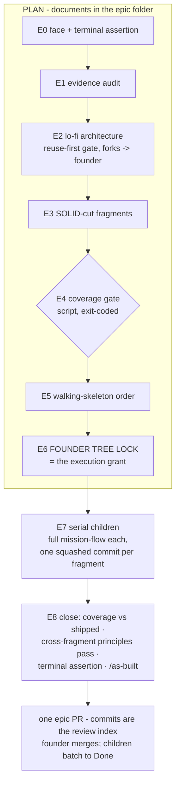

# epic-flow - as built

> The living record of the epic altitude: what shipped and the why that still
> matters. Usage lives in `.claude/skills/epic-flow/SKILL.md`; this doc is the
> rationale. Promoted 2026-09-03 from the MC-017 plan at the epic's close.
> (Home: framework/ - the repo allowlists its tracked roots and docs/ is not one.)

## What it is

epic-flow plans work whose correct shape is several tickets and executes it by
composing mission-flow: gated planning stages E0-E6 produce a founder-locked
tree of fragment briefs; execution runs each fragment as a full child
mission-flow whose Phase 7 is replaced by a squash onto one epic branch; the
epic ends as a single PR whose commits are its review index. The epic folder
is the state machine - a cold session resumes any epic by reading it.

## The design, as built

- **A sibling skill, not a mission-flow flag.** mission-flow's one-ticket
  contract is its value; the epic altitude composes it and inherits every
  per-ticket standard unchanged. Phase 0 routes epic-sized verdicts here.
- **Standards bind at design time, where violations are cheapest:**
  reuse-first with named counterparts at E2; SRP/ISP/OCP as the decomposition
  rule at E3; DRY mechanical at E4 (`tools/epic-coverage` exits 1 on unclaimed
  remainders AND over-claims - two owners of one output is duplication
  scheduled in advance); "real path end to end" as E5's walking skeleton.
- **The E6 lock IS the autonomy grant** - exactly the locked tree, in order,
  no re-asking between children, nothing outside the tree ever. Stops stay
  per-child and pause a fragment plus its dependents; independent lanes
  continue.
- **One branch, one squash per fragment, one PR.** Bisect holds at ticket
  granularity; review weight moves to the end deliberately, kept tractable
  because every child was reviewed pre-squash and the PR indexes commits to
  tickets. Push authority extends to the epic branch alone.
- **E8 exists for what per-child review cannot see:** the cross-fragment
  principles pass over the whole epic diff (cross-child duplication and
  contract drift are invisible to reviewers who each saw one diff), coverage
  re-run against SHIPPED artifacts (ticket text is the weakest evidence), and
  the terminal assertion declared at E0 and executed literally at close.
- **`--decide minor`** settles only decisions passing all five rubric
  conditions (reversible in-branch; no schema choice; no cross-fragment
  contract change; no product-visible fork; no new dependency - dev deps and
  authored migrations included). Each decision: a real-time line, a
  `decide_log` entry in the brief, an E8 enumeration with founder-gated /adr
  proposals. The rubric is also the definition of a trivial fork for every
  child - one vocabulary.
- **Invalidation reverts, never rebases.** A dead fragment stops its lane;
  E3'/E4'/E6' re-plan and re-lock only the changed subtree; squashed work
  reverts on the epic branch with a logged deviation. Published history stays
  honest.

## The why that still matters

- **Hi-fi planning is just-in-time** (each child's own Phase 1), never
  up-front for all fragments: detailed plans rot, and lived epics kept
  reshaping later fragments with earlier fragments' discoveries.
- **The coverage gate exists because of a real loss:** an 11-phase plan filed
  as 18 tickets once left four schema objects owned by no ticket, invisible
  because two tickets described them in detail while neither built them.
- **The batch-transition rule** (children park in review; Done arrives with
  the epic merge) keeps tracker truth aligned with what a reviewer can still
  reject.
- **Rejected alternatives:** a WIP-cap on child PRs (dissolved by the
  one-branch model - there are no child PRs); rebase-based cleanup (destroys
  the review index); up-front hi-fi specs (rot); a mission-flow `--epic` flag
  (would have grown the one-ticket contract into two).
- **Deviations reflected:** the E0 docs-viewer step may be skipped by logged
  deviation when generating a viewer is disproportionate (register W4-DEV-1);
  the step's purpose - the founder watching the plan live - is the test.
