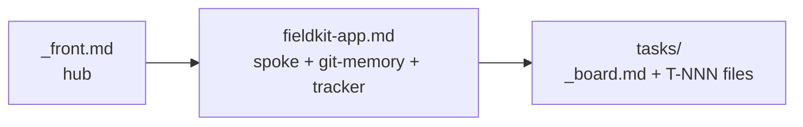

# Examples - what good looks like, filled

A fictional single-project front - **fieldkit**, run by a fictional solo
founder, Mara Voss - filled the way the templates mean it. Imitate the
density, not the content: every line earns its place, git facts live only
in the spoke, the board is derived from the task files.

| File | Shows |
|---|---|
| `fieldkit/_front.md` | a hub: big picture, posture, trust, project map |
| `fieldkit/fieldkit-app.md` | a spoke: deep context, git-memory, `tracker:`, the dispatch identity header |
| `fieldkit/tasks/_board.md` | a board mid-week (derived view) |
| `fieldkit/tasks/T-001-...md`, `T-002-...md` | task files meeting the description floor |

This is the single-project form (spoke beside the hub). A multi-project
front houses each project in its own directory - structure and promotion
rule in `framework/task-board.md`. Other archetypes vary only the
fields: an employer or client front registers in place with the IP
boundary in its hub; an OSS front records `tracker: github` and the
community's conventions (CI before any push) in its spoke.
