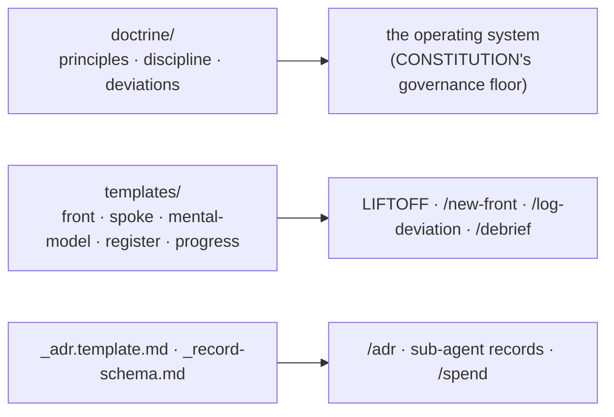

# The Kit - templates and doctrine the OS runs on

Not a product, not a bootstrap - this folder is the framework's own
plumbing: the full text behind the CONSTITUTION's governance floor, and
the templates the skills instantiate.

## doctrine/ - the governance floor, full text

| File | Holds |
|---|---|
| `engineering-principles.md` | the 9 principles (evidence before claims, source first, gate-locked phases, implement exactly, no self-approval, log deviations, test plans before code, deviations propagate, real-evidence-only) |
| `operating-discipline.md` | the 12 operating rules, with the reasoning and failure modes behind each |
| `deviations-protocol.md` | the register discipline: row format, discovery sources, log-before-fix, the hardening sweep |

## templates/ - what the skills instantiate

| Template | Instantiated by | Becomes |
|---|---|---|
| `_front.template.md` | LIFTOFF Stage 2, `/new-front` | a front hub (`_command/portfolio/<front>/_front.md`) |
| `_repo-context.template.md` | LIFTOFF Stage 2, `/new-front` | a repo spoke with git-memory |
| `_mental-model.template.md` | LIFTOFF Stage 2 | `_command/mental-model.md` |
| `_deviations-register.md.template` | `/log-deviation` | a project's `deviations-register.md` |
| `_progress.md.template` | `/debrief` (first touch of a project) | a project's `progress.md` |

## Root files

- `_adr.template.md` - the decision-record shape `/adr` fills.
- `_record-schema.md` - the IO contract: every dispatched sub-agent
  returns exactly one record in this shape (model x effort as dispatched,
  inputs, outputs, evidence). `/spend` reads these.

## Origin (provenance dedup map)

| Rule / capability | Source lineage |
|---|---|
| 9 engineering principles · 12 operating rules · gates · deviations · session continuity | a governance kit, battle-tested on real projects |
| AI-CTO identity · plan-before-spend · sub-agent execution · model x effort routing · context isolation · IO record contract · learning log · invisible rigor | an orchestration method, battle-tested on a real multi-front portfolio |
| Visualization contract · cadence + trackers · unified continuity stack · ADR template · the founder layer · single-source hoisting | house rules |
