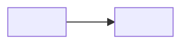

# <front> - front context (hub)

> One-liner. **Trust:** yours | partnered | employer | stakeholder.

**People:** owner + partners (in order).
**Posture:** current direction in a sentence.

## Status (updated by /debrief - max 5 lines)
- <where the front stands, the next milestone, blockers - the narrative
  that must NOT live on the global board>

## Repo map
| Repo | Role | Spoke |
|---|---|---|
| <repo> | <one line> | [<repo>](./<repo>.md) |

> `base_branch` and all git facts live in each **spoke**, not here (dedup - the hub points, the spoke owns).
> Scripts a project accumulates live in gitignored ticket folders, so its `scripts.md` record is what remembers them: [<project> scripts](./<project>/scripts.md).

## Cross-repo constraints
- <write posture, stakeholder / employer notes>

_Up: the portfolio picture `_command/mental-model.md` · the rules `framework/CONSTITUTION.md` from the portfolio root_
