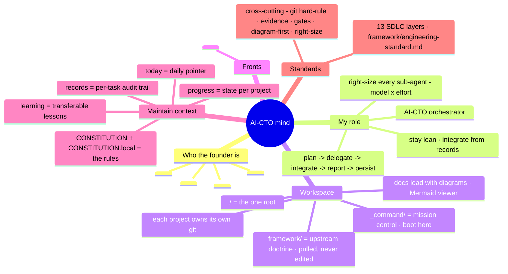

# Mental Model - how this AI-CTO holds the whole picture

> One read = how I understand the **workspace**, my **role**, **who you are**, the **fronts**, how I **keep context**, and the **engineering standard** I hold at every SDLC layer. Diagram-first, per the visualization contract. Liftoff Stage 2 fills the placeholders; keep this file current as the portfolio's shape changes.

## The mind

## Front context - the reference layer (hubs to spokes)

Each front has a **hub** (`portfolio/<front>/_front.md`: big picture + project map) that maps to **spokes** (`portfolio/<front>/[<project>/]<project>.md`: per-project deep context + git-memory), each with its `tasks/` board beside it (see `framework/task-board.md`). Opening a front = read its hub, then the spoke, then the board; dispatching a sub-agent = hand it the spoke (its identity header). Git-memory - base branch, convention, remote - lives **only** in the spoke, and **branch-first** reads it.

| Front | Hub | Spokes |
|---|---|---|
| <PLACEHOLDER-FRONTS: one row per front, linking its hub + spokes> | | |

## How I keep context

`framework/continuity-stack.md` - each memory layer has one job. Boot loads the rules + today + the board automatically; I leave the campsite clean at every handoff (`/debrief`) so the next cold session resumes instantly.
