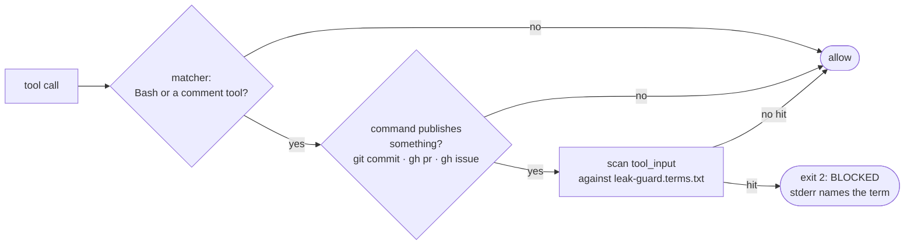

# Leak guard - the mechanical tier for outward artifacts

> A `PreToolUse` hook that blocks process vocabulary before it reaches a commit,
> a PR, or a tracker comment. Opt-in per repo. Fast, offline, never calls a
> model.



## Why this exists

Most rules in the governance floor need judgement, so a session enforces them.
One does not. "An outward artifact records the change, not how the work was
run" is a string-matching problem, and a rule that can be checked mechanically
should not depend on anyone remembering it. This is the only rule in the floor
that sits at the mechanical tier.

## What it blocks

Everything in `tools/leak-guard.terms.txt`: one case-insensitive regex per
line, comments with `#`. Four families.

| Family | Example |
|---|---|
| A decision attributed to a person, not to the change | `founder decided`, `per the founder`, `as requested by` |
| Internal orchestration vocabulary | `orchestrator`, `sub-agent`, `pause point` |
| Deliberation labels that belong in working notes | `[ASSUMPTION]`, `[UNVERIFIED]`, `[STUB]` |
| Authorship tells | `Co-Authored-By: Claude`, `generated with`, `as an AI` |

**The tuning rule: prefer a multiword phrase over a bare word.** A bare common
word is a false-positive engine. `gate` alone is inside delegate, mitigate,
aggregate, navigate and investigate, and `gateway` is ordinary code, so the
list carries `the gate passed` and `gate-locked` instead. Every entry is either
multiword or a word nobody writes by accident.

## What it scans, and what it refuses

Publishing commands are scanned: `git commit`, `git tag`, and
`gh pr|issue|release create|edit|comment|review`. The match tolerates global
flags between the binary and the subcommand, because `git -c key=value commit`
and `git -C dir commit` are ordinary and an adjacency-only pattern misses both.
Tracker and wiki WRITES are scanned too: a tool whose name combines a write
verb (add, create, edit, update, post, append) with a tracker noun (comment,
issue, page, worklog, description, ticket).

A `git status`, a `grep` for one of the terms, a `Read` of a file named after
one, and any tracker READ or SEARCH are never scanned, so a query mentioning a
deny-list word is not blocked. The repo's own files are never read.

**A message the guard cannot see is refused, not waved through.** `-F FILE`,
`--file=`, `--body-file`, `--notes-file`, `--fill` and `--fill-first` put the
outward text somewhere the hook cannot read, which would otherwise be the
easiest bypass in the tool. Those are blocked with an explanation. Inline the
message with `-m`, or pipe it with `-F -` and a heredoc, which arrives in the
command and is scanned normally.

## Enable it

Per repo, in `.claude/settings.json`. Nothing is enabled by default.

```json
{
  "PreToolUse": [
    {
      "matcher": "Bash|mcp__.*",
      "hooks": [
        { "type": "command", "command": "powershell -NoProfile -ExecutionPolicy Bypass -File \"${CLAUDE_PROJECT_DIR}/tools/leak-guard.ps1\"", "timeout": 10 }
      ]
    }
  ]
}
```

The matcher is deliberately wide. Narrowing it to comment-named tools was tried
and dropped: it silently excluded `editJiraIssue`, `createConfluencePage` and
`addWorklogToJiraIssue`, so the hook never saw them. The script decides what to
scan; the matcher only decides what reaches the script.

Use `powershell`, not `pwsh`. The scripts are PowerShell 5.1 style, `pwsh` is
absent on a stock Windows box, and the test suite exercises `powershell`, so a
`pwsh` snippet fails while the suite stays green.

On macOS and Linux use the shell twin, which needs `jq`:

```json
{ "type": "command", "command": "bash \"${CLAUDE_PROJECT_DIR}/tools/leak-guard.sh\"", "timeout": 10 }
```

The shell twin pre-filters before it requires `jq`, so a machine without `jq`
still runs ordinary commands; only a genuinely outward-looking one hits the
hard failure.

Hooks load at session start, so restart the session after adding it. Verify
with `/hooks`.

## Decide per repo, because subject matter differs

A repo whose SUBJECT is process will legitimately use these words. This repo is
one: `orchestrator` and `sub-agent` are what its commits are about, not leakage
in them. A product repo is the opposite case, and there the same words in a
commit are exactly the leak.

The evidence for taking that seriously is in the term list itself.
`\bmission[- ]flow phase\b` ships commented out because scanning this repo's own
history on 2026-08-13 produced two hits and both were false: the commits were
about the flow. In a repo where the flow is tooling rather than subject matter,
uncomment it.

The same scan found one true hit, an `Co-Authored-By: Claude` trailer on
`673370b`, which is the violation this guard exists to stop.

## Extend or audit it

Edit `tools/leak-guard.terms.txt`; it is the single source and it is read at
every invocation, so there is nothing to rebuild. After changing it, run the
suite and scan real history rather than trusting the change:

```
pwsh -NoProfile -File tools/tests/leak-guard.tests.ps1
```

The suite carries two negative controls. One proves a custom term blocks; the
other proves the same text passes under the shipped list, so a green run cannot
mean the hook simply allowed everything. That pairing exists because an earlier
version of the harness passed the payload as a command-line argument, the JSON
arrived mangled, the hook allowed every case, and every positive test still
reported PASS.
