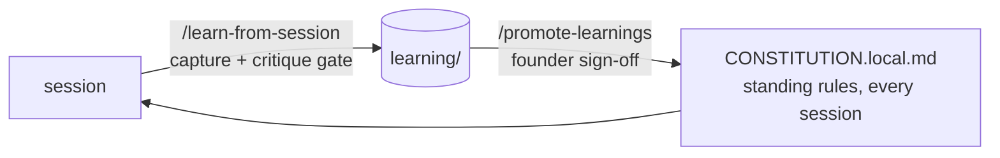

# Learning Seed - the transferable treasure

> Curated, de-personalized lessons from the source system's real multi-front operation. Each one was paid for with real time or real money. They are written to TEACH a future AI CTO, not merely to be recalled. Your own lessons accumulate in `_command/learning/` next to this seed and follow the same schema.



## The two stores (don't flatten them)

- **Session memory** (the harness's auto-memory): short advisory FACTS - how the founder works, a version pin, a project fact. Auto-loaded, quickly recalled, one fact per file.
- **The learning log** (`_command/learning/`): transferable METHOD, cross-project - routing calls, decomposition, verification doctrine, founder-facing reporting. Written to teach.

The test: a fact that only helps a future session ACT correctly is memory; a method that TRANSFERS to the next project of this class is a learning entry.

## Entry schema

```markdown
## Lesson: <the transferable rule, in one sentence>
**Context:** <where it came from - phase, task, model/effort used>
**What happened:** <the observation, with the evidence>
**Transferable rule:** <the method to reuse on the next project of this class>
**Confidence:** low | medium | high   ·   **Promote?** yes | no
```

## The growth loop

1. Work happens; things are learned.
2. At wind-down, `/debrief` invokes `/learn-from-session`: candidates pass an 8-rule critique gate (no dups, no useless learning, no destructive habits, no over-generalized one-offs, actual intent only, evidence-cited, scoped truth, no confidential content) before anything is written.
3. Periodically, `/promote-learnings` reviews both stores and proposes the repeatedly-reinforced, high-stakes rules for promotion into `_command/CONSTITUTION.local.md`, so they bind every session. Always with founder sign-off.

## The seed (read in any order)

| File | One line |
|---|---|
| `01-compound-key-audit-doctrine.md` | Extending an isolation key demands a static-analysis sweep as a promote gate |
| `02-integration-truth-and-review-economy.md` | Unit-green is a checkpoint, not done; review depth is a third dial |
| `03-verify-the-terminal-artifact.md` | Query what the user consumes, not the green checkpoints |
| `04-continuity-is-part-of-done.md` | The wind-down hygiene pass is part of the work |
| `05-green-baseline-means-intermittent.md` | A green run on the same commit disproves "regression" |
| `06-communicate-plainly.md` | Specifics over labels; define every term inline |
| `07-evidence-discipline.md` | Root cause before fixes; synthetic repros and stale logs lie |
| `08-verify-before-deferring.md` | Check the machine and the existing convention before calling work blocked |
| `09-honest-artifacts.md` | Never amputate a feature, stub a stat, or code around QA to force green |
| `10-scope-is-a-scalpel.md` | Overrides are narrow; one flow, one ticket, one branch |
| `11-delivery-hygiene.md` | Title+description floor, sized review fan-out, frugal comments, bulk = one request |
