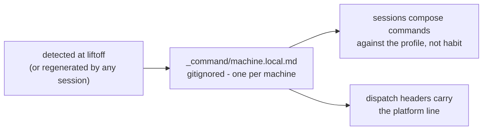

# Platform - the machine contract

> Commands fail on slash style, shell dialect, and tools that do not
> exist on this OS. The fix is a per-machine profile
> (`_command/machine.local.md`), auto-detected, always loaded, and
> consulted before composing any nontrivial command.

## The contract rules

1. **Compose against the profile, never from habit.** Before any
   nontrivial command: does the tool exist here (the inventory)? Is this
   syntax THIS shell's (the dialect rules)? Another machine's habits are
   the leading cause of broken commands.
2. **Never assume a tool exists.** The profile lists what is absent that
   habit might expect - with the local equivalent to use instead.
3. **Path discipline.** The profile's path style governs. Quote paths
   with spaces. Know that a POSIX-shell tool on Windows wants
   `/c/Users/<you>/` forms while the native shell wants `C:\Users\<you>\`.
4. **Per machine, self-healing.** The profile is gitignored (a second
   machine's clone must not inherit the first machine's facts). Any
   session that finds it missing, or its `os:` line not matching the
   running OS, regenerates it by detection - no founder input needed.
5. **Injected at dispatch.** Sub-agent identity headers carry one
   platform line sourced from the profile at dispatch time - never baked
   into spokes, because spokes travel and machines differ.

## The per-OS pitfall crib (liftoff copies the applicable lines)

**Windows / PowerShell 5.1:**
- No `&&` / `||` pipeline chaining (parser error) - use `;` or `if ($?)`.
- `powershell -File` does not pass array parameters - use `-Command` for
  multi-value flags.
- Destructive cmdlets may prompt - pass `-Confirm:$false` deliberately;
  `-ErrorAction SilentlyContinue` hides output but not the exit code.
- `robocopy` exit codes 0 to 7 mean SUCCESS - never treat nonzero as
  failure without reading it.
- Console or capture layers may mangle unicode output even at a utf-8
  code page (checkmarks render as mojibake in captured logs) - judge
  results by exit codes and text, not glyphs.
- Prefer cmdlets over unix names in PowerShell (`Move-Item` over `mv` -
  the aliases exist but argument semantics differ).

**macOS:**
- BSD tools, not GNU: `sed -i` needs an argument (`sed -i ''`), `date`,
  `stat`, `grep` flags differ from Linux examples.
- No `robocopy` / PowerShell by default - use `rsync` / `cp -R`.
- `zsh` is the default shell - bash-isms in `.bashrc` era examples may
  not apply.

**Linux:**
- GNU userland; the crib's Windows and BSD warnings do not apply, but
  distro package managers differ - the inventory says which exists.

**Everywhere:**
- The harness's own file tools (read, grep, glob) are not shell tools -
  a bundled ripgrep does not mean `rg` exists on PATH.
- Version pins in a repo's CLAUDE.md outrank the machine default
  (`nvm use` before node commands where pinned).
