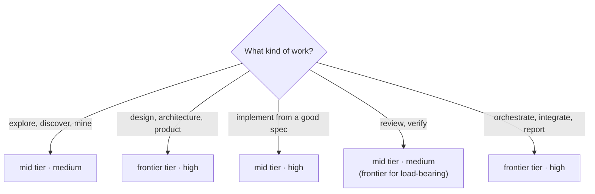

# Roles - the SDLC routing reference (not a roster)

> Honors `routing-grid.md`: *the model dial is the durable lever; the named-agent wrapper is convenience.* So instead of a bespoke agent zoo, this is a reference table mapping SDLC work to a recommended built-in agent or skill, a model x effort preset, and the escalation trigger. Any equivalent agent slots in.

Model tiers here mean: the cheap tier, the mid tier, and the frontier tier of whatever model family your harness runs (on Claude Code today: haiku, sonnet, opus-class).

**Ceilings first:** the routing ceilings in `_command/CONSTITUTION.local.md` cap these presets - a frugal posture steps each row down; a missing tier maps to the nearest available one (no frontier tier at all: every frontier row falls to the mid tier, and judgment work earns `--thinking high` instead). Presets are defaults, not entitlements. An invocation's `--spend lean` steps dispatches one further tier down, always below the ceilings, never above.

| SDLC work | Use (built-in) | model x effort | Escalate when |
|---|---|---|---|
| Discovery / research | an explore/research agent + web search | mid · medium | cross-source judgment: frontier · high |
| Product / requirements | the session + a brainstorming skill | frontier · high | - |
| Architecture / API | an architect/plan agent | frontier · high | - |
| Implementation | an implementer agent + test-driven development | mid · high | core / load-bearing logic: frontier |
| Spec compliance review | a spec-reviewer agent | mid · medium | - |
| Quality review | a code-quality reviewer | mid · medium | load-bearing: frontier · high (two-stage) |
| Debugging | a systematic-debugging discipline (+ implementer) | mid · high | - |
| Security | a silent-failure / security review | mid · medium | - |
| Docs / ADR | the session (light) | mid · low | - |
| Orchestration | the session itself | frontier · high | final synthesis: xhigh |

**Review-depth is a third dial** (see `learning-seed/02-integration-truth-and-review-economy.md`): heavy two-stage review (spec, then quality, separate reviewers) for new core logic, security-critical code, and the make-or-break feature; lighter combined single-reviewer passes for small fixes, config, and mechanical threading. Log the choice as deliberate, never a silent skip.

**Fan-out sizing (binding, from `routing-grid.md`):** before ANY parallel batch of agents, state the size - **N agents x model x effort, roughly estimated in tokens** - and get an explicit go. A "go" on a goal is never a "go" on N expensive agents. Escalate on evidence, not anxiety: start at the lowest dials that could plausibly hold the bar and re-run higher only if the output actually fails.

**A dispatched agent inherits the parent's git credentials** - the SSH agent socket, the `gh` token and the configured credential helper all carry over, established by probe rather than assumed. Isolating an agent's working tree therefore does not isolate the remote: a write-capable dispatch can push to any branch those credentials reach. No dispatch-time control exists, so the outbound path is held by instruction plus checking the tree and the remote after the agent finishes, never by anything that blocks the push before it happens. This is the canonical statement; a skill that dispatches applies it rather than restating it.
