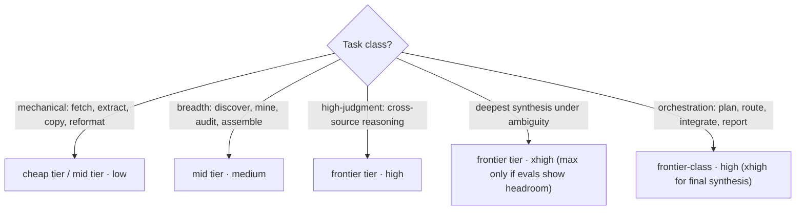

# Routing Grid - model x effort

> The token-economy core. **Two independent dials, both set deliberately for every sub-agent.** The defaults below were earned empirically on the source system's real orchestration runs.

## The two dials

- **`model:`** - *which* brain: the cheap tier / the mid tier / the frontier tier (or a full model ID, or `inherit`).
- **`effort:`** - *how hard it thinks*: `low` / `medium` / `high` / `xhigh` / `max`. **Default is `high`** (current harness default) - so for cheap, mechanical work you must step *down* explicitly. That's where the savings hide.

Orthogonal: a cheap model at high effort, or a strong model at low effort, are both valid. Don't assume "bigger model = more thinking."

## Rules of thumb

- **Escalate on evidence, not anxiety.** Start at the lowest model + effort that could plausibly hold the bar; only re-run higher if the output *actually* fails. Record the escalation as a lesson.
- **High-judgment does not mean max effort.** A rubric is a scaffold that lets you hold *effort down* while keeping the *model up*.
- **Token economy is a tracked metric.** Each status report states roughly which model x effort did which task and why. (The `/spend` skill reads this from the dispatch records.)

## Proven defaults (evidence: the source system's routing lessons)

| Lesson | Rule |
|---|---|
| The frontier model earned its cost **exactly once** on a five-stage research run - at the rubric-bounded scoring step; `max` there would have bought nothing | Reserve the frontier model for the one step where judgment is cross-source AND the cost of a plausible-but-wrong answer is highest |
| The mid tier held the bar for **all** breadth + assembly; escalation never fired | Default breadth/assembly to mid-tier; escalating "to be safe" burns the budget the discipline exists to protect |
| A generic executor + `model` override survived custom-agent failure mid-session | Keep task prompts portable; the model dial is the durable lever, the named-agent wrapper is convenience |
| Long single-shot generation timed out; interleaved write-one-section-per-call completed | Stage long input+output generation (Write, then Edit-append per section). Each tool call resets the idle timer |

## Per-session ceilings (levers)

- `CLAUDE_CODE_SUBAGENT_MODEL=<model>` - pin every sub-agent's model.
- `CLAUDE_CODE_EFFORT_LEVEL=low|medium` - pin effort globally.
- `/effort low|medium|high|xhigh|max` - interactive thinking depth (`low/med/high` persist; `max` resets at session end).
- Resolution priority (both dials): env var > invocation > frontmatter > session default.

## Fan-out is where the budget dies

> A mis-sized single sub-agent wastes cents. A mis-sized **fan-out** wastes the window. A real incident from the source system: one saved research **workflow** fired **107 agents at frontier-model max effort** and burned roughly 60 percent of the token window in a single opaque call - because saved workflows and global skills set **no model override**, so their agent calls **inherited the session model + max effort**.

**Recommendation:** deny any one-call fan-out tool in your settings; its hazard - one opaque call fanning out dozens of agents, with no per-agent effort dial - is incompatible with "right-size + present each + plan-before-spend."

**All multi-agent work goes through incremental, per-agent-sized dispatch instead:**
- **Per-task dials are native** - each dispatch carries its own `model` (+ effort where supported). This IS the two-dial control one-call fan-outs lack.
- **Visible + incremental** - agents are dispatched one (or a few) at a time and each is reported back, so a runaway burn cannot happen silently.
- **Plan-before-spend still applies** - for any *parallel* batch, state the size (# agents x model x effort) and get an explicit go first.
