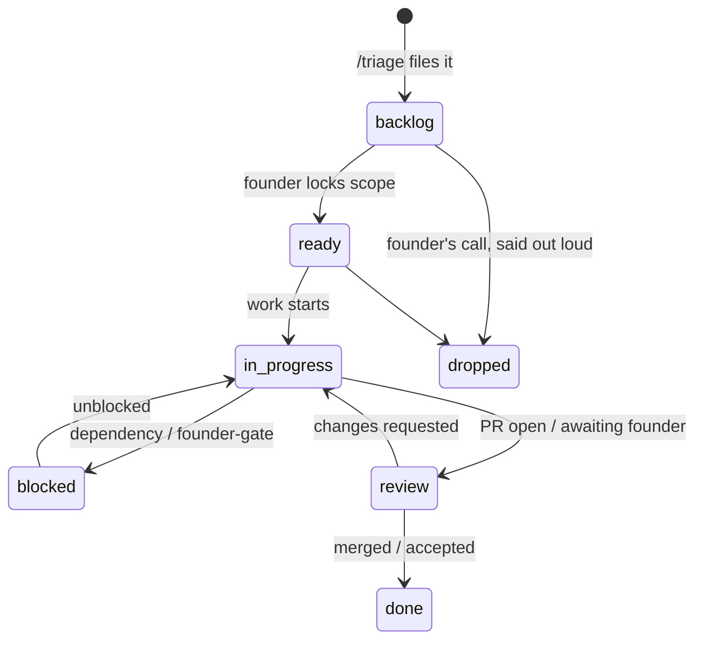

# Task Board - the work queue

> The file-native tracker: one board per project, one file per task, states you can grep. Written by `/triage`, `/mission-flow`, and `/debrief`; read by `/briefing` and any session picking up work; audited by `/preflight`.



## Where boards live

`_command/portfolio/` is the management tree: each front's hub, spokes, and work queues together.

**Multi-project front** - each project has a housing directory with its spoke and its board:

```
_command/portfolio/<front>/
├─ _front.md                    hub
├─ <projectA>/
│  ├─ <projectA>.md             spoke
│  └─ tasks/                    _board.md + one FOLDER per ticket (see below)
└─ <projectB>/
   ├─ <projectB>.md
   └─ tasks/
```

**Single-project front** - no housing directory:

```
_command/portfolio/<front>/
├─ _front.md
├─ <project>.md
└─ tasks/
```

**The promotion rule:** when a second project joins a single-project front, `/new-front` restructures in the same pass - housing directories are created and each spoke + `tasks/` moves into its own. A task's identity is its filename, not its path, so ids and history survive the move.

## Front placement - register, move, or copy

How a front's repo relates to the portfolio root is the founder's choice per
front; each keeps its own git, invisible to the portfolio via the allowlist:
- **register-in-place** - the repo stays where it is; the spoke records its path.
- **move-in** - relocate the repo under the portfolio (instant, same-drive).
- **copy-in** - duplicate it under the portfolio, leaving the original live for
  parallel work. Copy read-only, excluding regenerable / lock-prone dirs
  (`node_modules .next dist build .venv __pycache__ ...`) so a running dev
  server is never disturbed, then reinstall deps in the copy.

Host the front repos in a single gitignored `fronts/` container at the portfolio
root rather than scattering them; the allowlist ignores it and `.gitignore`
names it explicitly. The spoke's `path:` records where the repo actually lives.

## The ticket - a folder (the truth)

A ticket is a **folder**, `tasks/<ID>-<slug>/`, whose name is its identity (ID
zero-padded and sequenced per board for the native tracker, or the external key
like `AI-1471`; slug in kebab-case). The folder moves as one unit when a
single-project front promotes to multi-project, so the id and its history
survive the move. Inside it, from `kit/templates/_task.template.md`:

- `ticket.md` - the record:
  - Frontmatter: `id, title, state, size (S|M|L), created, updated, branch, pr, parent`.
  - Body: the delivery-hygiene description floor - context, acceptance
    criteria, the **Definition of Done checklist** (the integration-truth floor,
    below), evidence log for the literal verification output, out-of-scope. No
    placeholders.
- The working subfolders - `scripts/ samples/ artifacts/ screenshots/` - the
  ticket's own working files. Full convention in the next section.

States live in `ticket.md` frontmatter: `backlog | ready | in-progress |
blocked | review | done | dropped`. Dropping is a founder call, said out loud -
a parked item is a decision; a silently rotting one is a debt.

**Ticket folders never delete.** `done` and `dropped` stay on disk as history
(cheap, greppable); they simply age off the board view, whose Done and Dropped
sections show only the 10 most recent each.

## Ticket filestorage - the working files

Real work generates working files: repro scripts, sample inputs, generated
outputs, QA screenshots. Given no home they sprawl across the workspace root -
the failure this convention exists to prevent. Every file a ticket generates is
owned by that ticket's id, inside that ticket's one folder.

**One folder per ticket.** The ticket IS the task, so there is one directory, not
two. The record and the scripts are the two things worth versioning; everything
else the folder accumulates is payload and stays local. Same for every front,
whatever its `trust:` and whatever its `tracker:`:

```
_command/portfolio/<front>/[<project>/]tasks/<ID>-<slug>/
├─ ticket.md      the record + the Definition-of-Done checklist + evidence log   [tracked]
├─ scripts/       repro / verify / one-off scripts - prevention infrastructure   [tracked]
├─ samples/       inputs · fixtures · datasets used to reproduce or verify       [gitignored]
├─ artifacts/     generated outputs · exports · dumps · logs                     [gitignored]
└─ screenshots/   QA / verification images                                       [gitignored]
```

Those three payload names are the convention, not the mechanism. Anything else you
put beside `ticket.md` and `scripts/` is gitignored too.

| Path | Tracked? | Why |
|---|---|---|
| `ticket.md` | yes | the record; the pasted literal verification output lives here as text |
| `scripts/` | yes | a repro/verify script is prevention infrastructure - it compounds, so version it |
| everything else beside them - `samples/` `artifacts/` `screenshots/`, or any name a session invents | **no** (gitignored) | disposable or heavy proof; contained per ticket, never bloats or leaks the repo |

Everything a ticket owns is under one `<ID>-<slug>`, so its record and its payloads
are always in the same place and the promotion rule moves them together.

**Tracked-repo hygiene - two rules that compose.**

First, the instance is local in full. `_command/` is gitignored by this repo, so
nothing under it, ticket records included, can be committed from a clone. The
product is `framework/` plus the skills; your instance is yours. Want history for
it? Keep `_command/` in a private repo of your own and carry the payload rule
below into that repo's `.gitignore`, which is where the Tracked column above
starts to bite.

Second, inside a ticket folder the payload never travels. The rule excludes the
folder's contents and re-includes exactly `ticket.md` and `scripts/`
(`**/tasks/*/*` plus two negations), rather than listing `samples/`, `artifacts/`
and `screenshots/` by name. A named list fails open on the first payload directory
nobody thought of, and for a confidential front failing open means committing
someone else's data. It is scoped to `tasks/<ID>/`, so a `samples/` directory that
belongs to product code is left alone, and it reaches one level below `tasks/`, so
`tasks/_board.md` stays tracked.

`tools/check-ignores.ps1` asserts both, on file paths rather than directory names:
a directory-only pattern cannot match a path git cannot resolve as a directory, so
asking whether a bare directory is ignored returns an answer that flips with
whether it happens to exist. That is how `_command/` came to be documented as
gitignored in two places while the rules tracked it.

Scripts stay tracked on purpose. Putting them in the ignored half was considered
and rejected: an unversioned repro script is lost on a fresh clone, cannot be
reviewed, and gets rebuilt from scratch by the next session, which defeats the
reason for writing it down.

**No working file is ever written inside a project repo's own tree.** That repo's
`.gitignore` belongs to its owner, so a promise made about it is one we have no
authority to keep. Here the rule is ours, and it already holds.

**External trackers (`tracker: jira | github`).** The ticket of record stays in
the external tracker, never mirrored here (the one-tracker rule). The folder
still exists as the working-file home; `ticket.md` shrinks to a pointer plus the
DoD checklist:

    > Tracked in: JIRA AI-1471 - <url>
    (then the Definition of Done checklist)

That is not a second copy of the ticket - it is the local artifact home and the
enforcement gate, keyed by the ticket id.

**Trust drives what the TRACKED record may say** - not where files live; the
storage split above is the same for every front. Each front's `trust:` is one of
`yours | partnered | employer | stakeholder`. `yours` / `partnered` carry full
detail in the spoke (still never secrets); `employer` / `stakeholder` are
**confidential** - the spoke and `ticket.md` carry pointers and process only
(path, remote, git-memory, tracker, posture, a neutral next-action), never
payloads: no code, secrets, ticket contents, or deliverable text in tracked
`_command/` content. Name the terrain (that an IAM role or a pipeline exists and
is sensitive) without recording the payload. A confidential front's heavy files sit
in the same ignored payload subfolders as everyone else's; trust changes the prose,
not the paths.

## The Definition of Done checklist (the integration-truth floor)

Every `ticket.md` carries this checklist; a ticket does not reach `done` until
each line is satisfied with evidence, or explicitly marked not-applicable with a
reason. It is the floor from `engineering-standard.md` made per-ticket and
enforceable; an instance may bind a sharper version in
`_command/CONSTITUTION.local.md`.

- [ ] **Real path, end to end.** No stub or mock on the critical path.
  "Compiles + unit-green" is a checkpoint, not done; every external boundary got
  one live integration pass. Any remaining stub is labelled `[STUB]` and the
  ticket stays open.
- [ ] **Whole vertical slice.** Both sides wired and verified against the
  acceptance criteria, proven by at least one test exercising the actual
  serialized request across the boundary (not two independent mocks of the same
  idea), with request validation so a contract violation is a clean 4xx.
- [ ] **Terminal artifact verified.** The thing the user consumes (the index,
  the rendered file, the row) was queried directly, broken down by the unit that
  can partially fail. A green checkpoint is a promise, not a receipt.
- [ ] **Designed for scale.** Bulk semantics, idempotency, and backpressure
  considered; an action over N rows is one bulk call plus a queue, never N
  requests.
- [ ] **Tested at the altitude of the risk.** User-critical flows have e2e
  coverage; unit is the floor, not the ceiling. The plan named the altitude.
- [ ] **No guess worn as a finding.** Root cause shown with literal evidence;
  assumptions labelled `[ASSUMPTION]`; external artifacts read as an engineer
  authored them, with zero process vocabulary.

## The board file (the view)

`tasks/_board.md` is DERIVED: one table per state, actionable states first, regenerated by whichever skill changes a task's state. No generator script - a board is small, and the skills rewrite it (content over machinery). If board and files disagree, the files win and `/preflight` flags the drift.

## One tracker per project (hard rule)

The project's spoke carries a `tracker:` field: `tasks` (this board governs) or `jira` / `github` (the external tracker governs, so `_board.md` does not - see External trackers above, where the ticket FOLDER still exists as the working-file home). Never mirror - no two layers, one job. A front can mix: a Jira-governed client project beside a native-board side project.

## Cross-front changes

Work that ripples across fronts (a shared library bump landing in three
products) gets **one task per affected project**, cross-referenced
(`<front>/<project>/T-NNN`); the driving task lists the whole set in its
body. Delivery stays one `/mission-flow` per repo - the flow is
one-ticket-one-branch by design - and the driving front's `/debrief`
tracks the set to done.

## Dedup with the other layers

| Layer | Job |
|---|---|
| `tasks/` | what to do - the queue |
| `progress.md` | what happened - the log |
| `daily/today.md` | the pointer - references task ids, never copies bodies |
| `deviations-register.md` | drift from plan |

Cross-references use `<front>/<project>/T-NNN` (single-project fronts: `<front>/T-NNN`).
