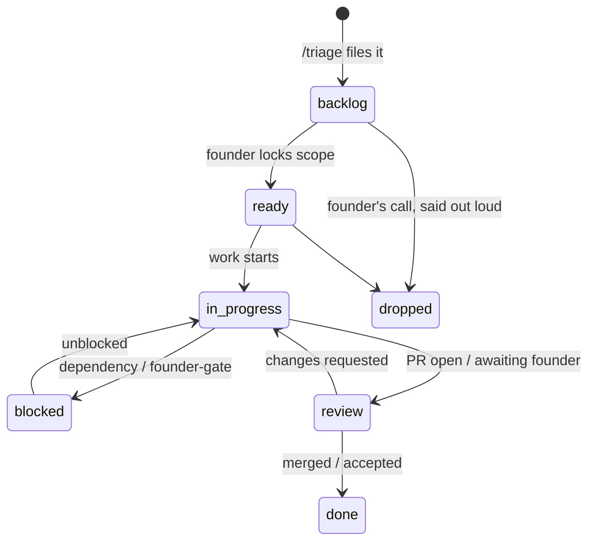

# Task Board - the work queue

> The file-native tracker: one board per project, one file per task, states you can grep. Written by `/triage`, `/mission-flow`, and `/debrief`; read by `/briefing` and any session picking up work; audited by `/preflight`.



## Where boards live

`_command/portfolio/` is the management tree: each front's hub, spokes, and work queues together.

**Multi-project front** - each project has a housing directory with its spoke and its board:

```
_command/portfolio/<front>/
├─ _front.md                    hub
├─ <projectA>/
│  ├─ <projectA>.md             spoke
│  └─ tasks/  (_board.md + T-NNN-<slug>.md ...)
└─ <projectB>/
   ├─ <projectB>.md
   └─ tasks/
```

**Single-project front** - no housing directory:

```
_command/portfolio/<front>/
├─ _front.md
├─ <project>.md
└─ tasks/
```

**The promotion rule:** when a second project joins a single-project front, `/new-front` restructures in the same pass - housing directories are created and each spoke + `tasks/` moves into its own. A task's identity is its filename, not its path, so ids and history survive the move.

## The task file (the truth)

`tasks/T-NNN-<slug>.md` - NNN zero-padded, sequenced per board. From `kit/templates/_task.template.md`:

- Frontmatter: `id, title, state, size (S|M|L), created, updated, branch, pr, parent`.
- Body: the delivery-hygiene description floor - context, acceptance criteria, evidence + repro for bugs, out-of-scope. No placeholders.
- States: `backlog | ready | in-progress | blocked | review | done | dropped`. Dropping is a founder call, said out loud - a parked item is a decision; a silently rotting one is a debt.
- **Task files never delete.** `done` and `dropped` stay on disk as history (cheap, greppable); they simply age off the board view, whose Done and Dropped sections show only the 10 most recent each.

## The board file (the view)

`tasks/_board.md` is DERIVED: one table per state, actionable states first, regenerated by whichever skill changes a task's state. No generator script - a board is small, and the skills rewrite it (content over machinery). If board and files disagree, the files win and `/preflight` flags the drift.

## One tracker per project (hard rule)

The project's spoke carries a `tracker:` field: `tasks` (this board governs) or `jira` / `github` (the external tracker governs and `tasks/` stays unused for that project). Never mirror - no two layers, one job. A front can mix: a Jira-governed client project beside a native-board side project.

## Cross-front changes

Work that ripples across fronts (a shared library bump landing in three
products) gets **one task per affected project**, cross-referenced
(`<front>/<project>/T-NNN`); the driving task lists the whole set in its
body. Delivery stays one `/mission-flow` per repo - the flow is
one-ticket-one-branch by design - and the driving front's `/debrief`
tracks the set to done.

## Dedup with the other layers

| Layer | Job |
|---|---|
| `tasks/` | what to do - the queue |
| `progress.md` | what happened - the log |
| `daily/today.md` | the pointer - references task ids, never copies bodies |
| `deviations-register.md` | drift from plan |

Cross-references use `<front>/<project>/T-NNN` (single-project fronts: `<front>/T-NNN`).
