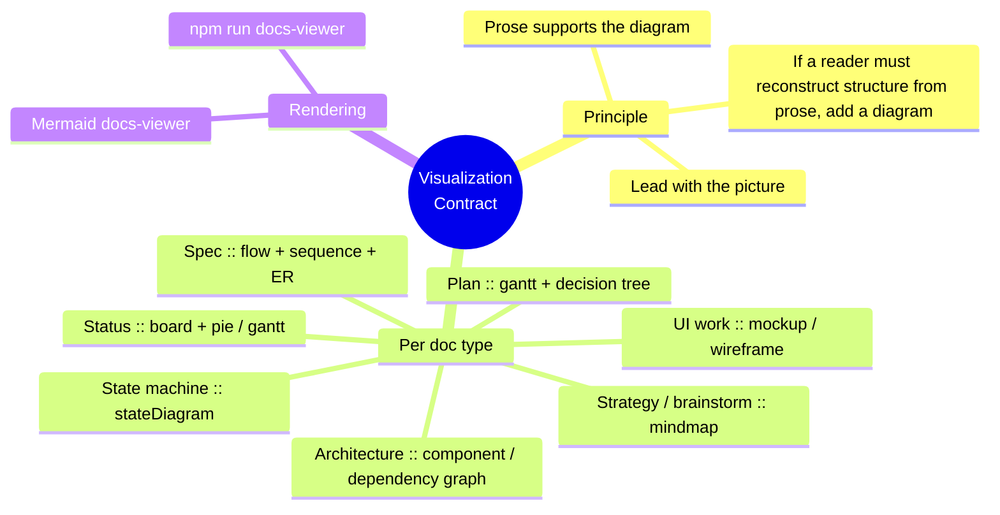

# Visualization Contract

> The house rule that fixes the wall-of-text problem: **every doc leads with a picture.** Diagrams are part of the documentation process, not an afterthought. Rendered live by the docs-viewer skill (optional; needs Node).



## 1. The principle

**Lead with the picture.** The first screen of any non-trivial doc is a diagram; the prose underneath explains it. If a reader has to rebuild the structure in their head from paragraphs, the doc is missing a diagram.

## 2. Required diagram per doc type

| Doc type | Required (lead) | Often also |
|---|---|---|
| **Spec** | flowchart - the user/feature flow | `sequenceDiagram` (data flow), `erDiagram` (data model) |
| **Architecture** | component / dependency graph | C4-style context where useful |
| **Plan** | `gantt` or phase timeline | decision tree where branches exist |
| **State machine** | `stateDiagram-v2` | (e.g. a signup flow, a job-queue lifecycle) |
| **Strategy / brainstorm** | `mindmap` | quadrant for trade-offs |
| **UI work** | mockup / wireframe (ASCII or image) | flow of screens |
| **Status / progress** | board table | `pie` / `gantt` portfolio view |

## 3. Mermaid cheat-sheet (the blocks we actually use)

````text
```mermaid
flowchart LR        A --> B          (flows, pipelines)
sequenceDiagram     A->>B: msg       (interactions, data flow)
stateDiagram-v2     [*] --> S1       (state machines)
erDiagram           U ||--o{ O : has (data models)
mindmap             root((X))        (decomposition, strategy)
gantt               (timelines, roadmaps)
pie / quadrantChart (status, trade-offs)
```
````

## 4. Discipline

- A diagram that's wrong is worse than none - keep it in sync with the prose (treat drift as a deviation).
- Don't diagram the trivial. A 3-line note needs no picture; a spec, plan, or architecture doc always does.
- Author-trusted, local sources only render in the docs-viewer (it renders Mermaid post-sanitize) - never paste untrusted diagram source.
