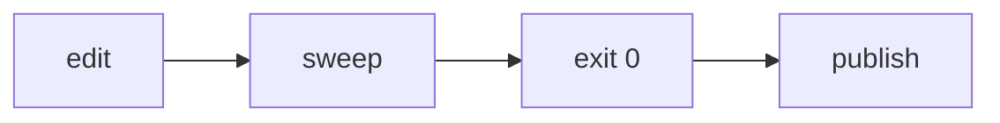

# tools/leak-sweep

The personalization firewall. It scans text for anything that identifies the
operator (names, emails, paths, secrets, old brand names) before it ships.

The two scripts enforce the same rules. One platform note: on user-path rules
the .ps1 uses a lookahead and the .sh an equivalent character class, so
templated examples like `C:\Users\<NAME>` pass both; prefer `~/` style paths
in shipped examples anyway.

Two run-sites, two rule sets:
- **promote mode** - before anything is published: the generic identity
  rules (paths, emails, keys, the legacy name) + your deny-list. Guards
  the PUBLIC repo.
- **instance mode** - at the end of LIFTOFF Stage 4 and inside
  `/preflight`: leftover template placeholders (`<PLACEHOLDER-...>`,
  `{{TOKEN}}`, `TODO-INIT`) + your deny-list if present. It does NOT run
  the identity rules - a private instance legitimately contains its own
  founder's paths and email. It reads `_command/` and the operating
  `CLAUDE.md`, not `framework/`, whose kit templates carry placeholders on
  purpose. The brace token must be a bare identifier, so a Mermaid hexagon
  node (`A{{"label"}}`) is not mistaken for an unfilled blank; an unquoted
  one (`A{{plain}}`) still needs the exempt marker.

Usage. **The first positional argument is the MODE in both entry points**, and
each mode picks its own targets, so a bare mode is the normal invocation:

- `tools/leak-sweep.sh [promote|instance] [root]`
- From a PowerShell session: `.\tools\leak-sweep.ps1 [promote|instance] [-Path <p1>,<p2>] [-PrivateList <file>] [-Root <dir>]`
- From any shell: `powershell -Command ".\tools\leak-sweep.ps1 instance"`
  (do not use `powershell -File` with a multi-value `-Path` - argument arrays do not survive `-File`)

Where the two still differ, because it is the kind of thing that gets
transliterated wrongly: the shell script takes the scan root as an optional
SECOND positional, while the PowerShell one takes `-Root` and `-Path` as named
parameters only. `$Mode` was not always first in the PowerShell param block, and
while it was second a bare `leak-sweep.ps1 promote` bound "promote" to `-Path`,
scanned nothing and exited 0.

Exit 0 means clean. Exit 1 prints `file:line: [rule] match` for each hit.

A line intentionally naming the operator can be exempted with a trailing
`MC-LEAK-EXEMPT: <reason>` marker.

`tools/leak-sweep.private.txt` is the operator's own deny-list, one term per
line, gitignored so it never ships. Cloners of this repo create their own.

`tools/check-refs.ps1` is the second gate: every `framework/`,
`.claude/skills/`, or `kit/` path named in a shipped doc must exist on
disk (exit 0 clean / 1 with the broken references). It exists because
removing a subsystem once left prose references to deleted files that a
filename grep could not catch. Windows-native; run it with the sweep
before any publish.

`tools/check-ignores.ps1` is the third gate: the paths that must be
gitignored are, and the paths that must ship still can be (exit 0 clean /
1 listing each problem). Where the sweep reads file contents, this one
reads the rules, because a doc claiming a path is ignored proves nothing
about what git will do. `/preflight` step 6 runs it at every spend tier.
